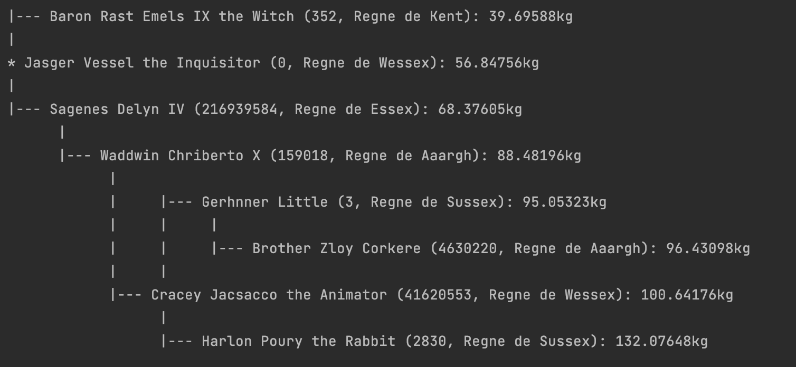

# DATA STRUCTURES - BTree, Graph, Rtree, #Table

This project implements a Graph, a Binary tree, an R tree and a Hash table from scratch. Among others things, in this project we compare the performance of each data structure in different use cases, so that we can determine which one is the most efficient for each use case.

**Main features:** 
- Add and remove nodes and edges in Graph. Find shortest path between two given nodes. 
- Add and remove nodes in Binary Tree. Find a node with a certain value in the tree. 
- Visual representation of Binary Tree and RTree.

 

**Programming Language:** Java

**IDE Specifications:**

IntelliJ IDEA 2022.2 (Ultimate Edition)  
SDK: Oracle OpenJDK version 18.0.2

**INSTRUCTIONS**

This program implements different data structures. Each data structure uses its own set of datasets of various sizes. To ensure that the datasets are read correctly, they must be placed in the different PATHs indicated in Main.java (lines 14-18).

For binary trees, starting from line 16 in Main.java, you can choose whether the tree implementation should be AVL or non-AVL.

**Libraries:**  
SWING has been used to create graphical interfaces for R-trees and hash tables.

**Images**   
One of the many functionalities of the project, is showing a visual representation of a binary tree. Users can add and delete nodes, and also can go through the tree to find every node within a range of values. 

# Authors
[Pol Valero] (https://github.com/pol-valero)

[Aaron Fort] (https://github.com/AaronFortG)

[Gemma Yebra] (https://github.com/gemma33y)

[Alex Liu] (https://github.com/Alello23)